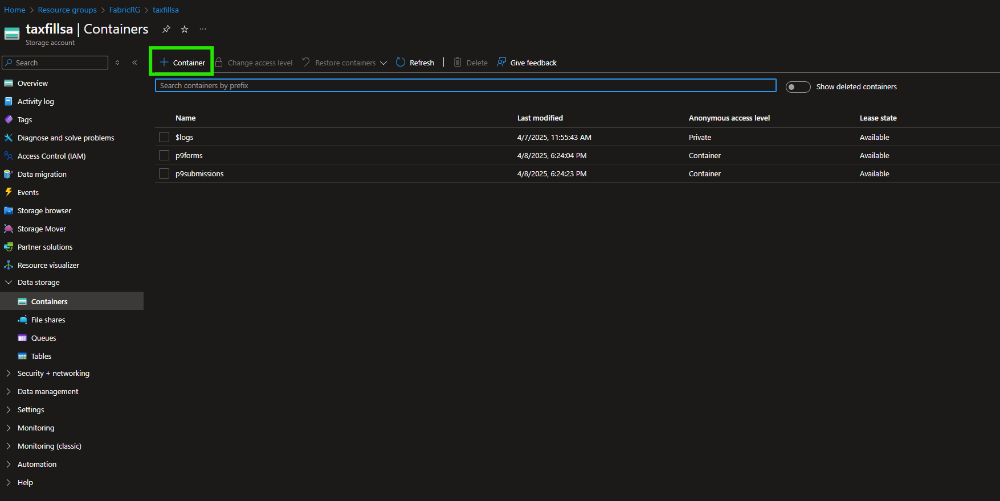
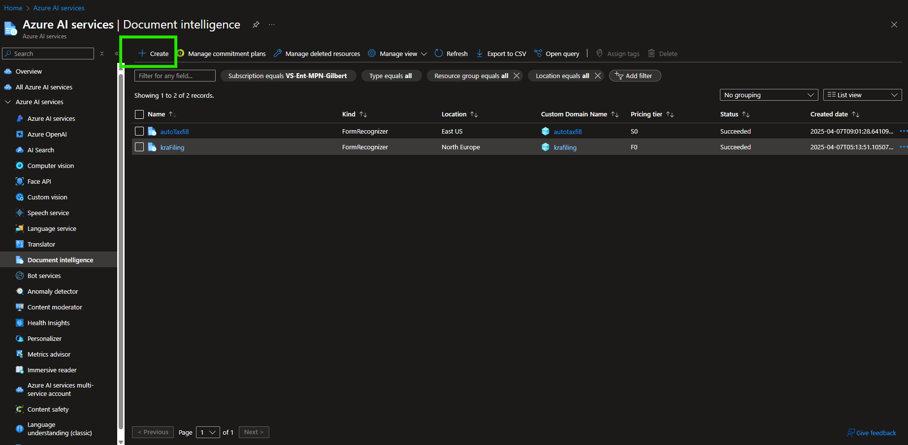
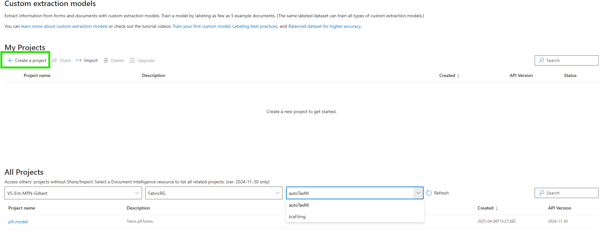
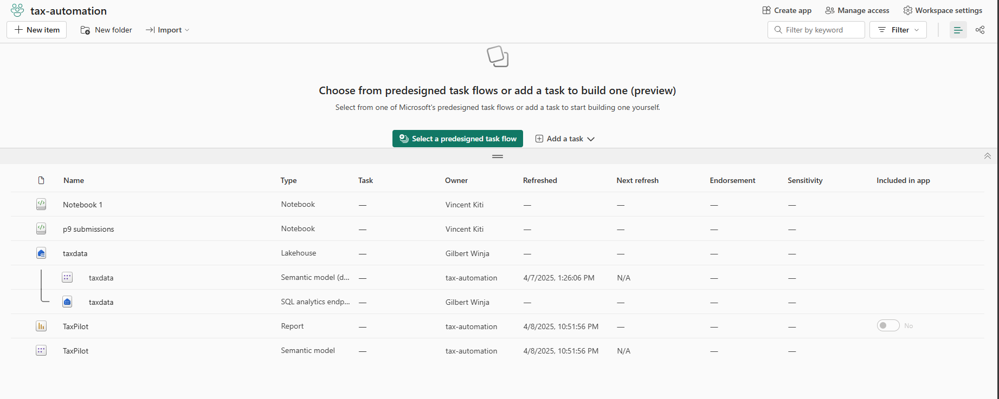
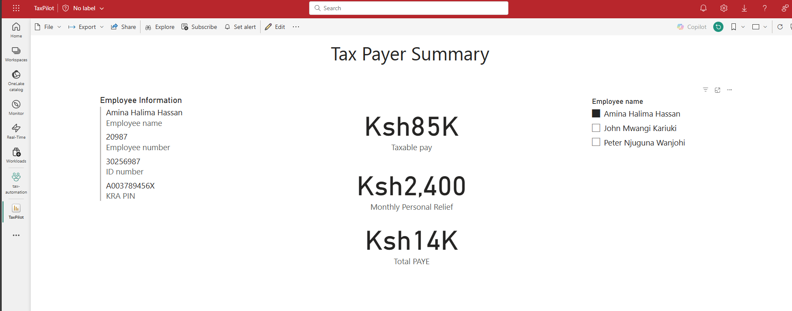

# 🧾 Tax Automation System Using Document Intelligence

This documentation outlines the architecture, workflow, and analytics pipeline of a **Tax Automation System** that leverages Azure **Document Intelligence** to train a custom model for extracting key fields from **P9 forms**. It also integrates **Power BI and Fabric** for user analysis and visualization.

---

## 📂 Azure Storage Accounts

We use two Azure Storage containers to manage and streamline the data flow:

Create an azure storage account, then create two containers as below



### 1. `p9-forms` – Training Data Source  
This storage account contains a curated dataset of P9 forms used to train the Document Intelligence custom model.

### 2. `p9-submissions` – User Uploads  
This storage account is the entry point of the user workflow. Each uploaded form is stored here and used for **continuous training** to improve the model.

---

## 🤖 Document Intelligence Model

The custom model is trained to extract key fields like:

- Taxpayer PIN  
- Employer Details  
- Gross Pay  
- PAYE Paid  
- Reliefs Claimed

### Model Training & Deployment

The model is trained using forms stored in `p9-forms` and deployed with a REST endpoint for inference.
1. create a Document intelligence resource 


---
2. create a new custom extraction project


---

## ⚙️ Application Workflow

The flow from user upload to prefilled Excel generation:

1. **User Uploads P9 Form**  
   Form is uploaded via the frontend and stored in `p9-submissions`.

2. **Form Processed by Model**  
   App triggers the Document Intelligence model endpoint to extract data fields.

3. **Generate Prefilled Excel**  
   Extracted data is formatted into a structured Excel sheet.

4. **User Reviews and Downloads**  
   The user verifies the details and downloads the Excel sheet for **KRA submission**.
[App Source Code](App.py)

---

## 📊 Fabric + Power BI Integration

To demonstrate downstream analytics, we simulate user data.Due to limited real P9 data access. This simulation mimics data from actual extractions and helps visualize:

- Unique Taxpayer PINs  
- Frequency of Filing Errors  
- Estimated Compliance Rates

### Sample user data:
```bash
[
    {
      "employee_name": "John Mwangi Kariuki",
      "employee_number": "10234",
      "id_number": "30125478",
      "kra_pin": "A001567890W",
      "taxable_pay": 50000.00,
      "total_mpr": 2400.00,
      "total_paye": 8000.00
    },
    {
      "employee_name": "Amina Halima Hassan",
      "employee_number": "20987",
      "id_number": "30256987",
      "kra_pin": "A003789456X",
      "taxable_pay": 85000.00,
      "total_mpr": 2400.00,
      "total_paye": 13600.00
    },
    {
      "employee_name": "Peter Njuguna Wanjohi",
      "employee_number": "15045",
      "id_number": "20458790",
      "kra_pin": "A004123678Y",
      "taxable_pay": 30000.00,
      "total_mpr": 2400.00,
      "total_paye": 4000.00
    }
  ]
```

This analysis can organizations track their PAYE submissions to KRA for log audits. Other functionalities include tax based reports such as average Payable income, PAYE, etc.


 ---
*User summary reports*


---

## 🧠 Key Benefits

- **Automated extraction** of key fields from structured financial documents  
- **Reduced manual entry errors** during tax filing  
- **Scalable training** as new data is continuously added  
- **Visual insights** for compliance tracking and operational intelligence  

---

## 🚀 Coming Soon

- Integration with KRA APIs for **direct form submission**  
- User authentication via **Azure AD B2C**  
- Role-based dashboards for HR/Admin use cases.  
